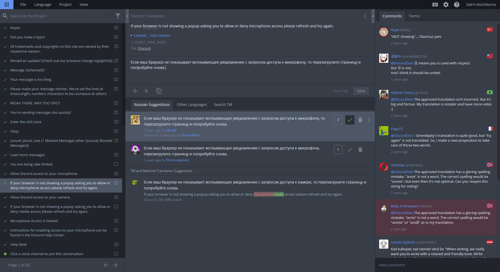

Пока вы ждёте принятия своей заявки или уже были приняты в проект, познакомьтесь с доступным вам инструментарием и процессом по переводу Discord.

## Редактор Crowdin

Знакомство начнём с нашего незаменимого редактора Crowdin, в котором вы будете проводить большую часть времени, работая над переводом.

Crowdin сфокусирован на работу __в команде__ и содержит обширное количество вспомогательных функций. Давайте разберёмся с его интерфейсом.

### Список строк 

Слева вы можете увидеть список строк по выбранному фильтру и поисковому запросу. Фильтры могут быть настроены самостоятельно по нажатию на кнопку с «воронкой». Изначально предложено несколько полезных фильтров (всё, строки без переводов, нуждающиеся в голосах и др.), но вы всегда можете настроить их самостоятельно.



В редакторе для текстовых файлов (`.txt`) и Markdown (`.md`) вместо строк отображается превью. Переключиться в режим обычного отображения можно нажав на кнопку с иконкой «глаза».





Слева от самих строк в списке, можно заметить разные символы. Вот что они обозначают:

- **Красный квадратик** значит, что строка не переведена;
- **Зелёный квадратик** сообщает, что строка переведена и можно голосовать;
- **Зелёная галочка** отображается для строк с утверждённым переводом (можно проверить его на ошибки ;).

Справа от строчки тоже могут быть значки комментариев:

- **Простой значок речи** отображается, если к строке имеются комментарии (на любом языке);
- **Значок речи с восклицательным знаком** предупреждает о комментариях, сообщающих о проблеме со строкой (на любом языке).

### Панель перевода

По центру находится панель перевода. По порядку: сначала идёт оригинальная строка и её описание (контекст), затем поле вашего перевода, варианты перевода от других участников и предложения машинного перевода.

Текст в строке может быть подчёркнут или выделен:

- Подчёркнутый текст означает, что для этого слова или предложения есть соответствующий термин перевода;
- Выделение используется для переменных (или их частей), которые переводить не надо. Клик по переменной вставляет её в поле перевода. Про переменные мы расскажем дальше.

### Комментарии и термины

Справа вы найдёте комментарии к текущей строке и поиск терминов, где изначально отображаются термины для текущей строки. Вы можете дополнить текущий термин или добавить свой, но учтите, что сначала их необходимо обговорить с другими переводчиками!

Комментарии к строке отображаются со всех языков одновременно, чтобы вы могли задать какой-то вопрос переводчикам других языков.

При написании перевода для участников команды перевода на свой язык общепринято, несмотря на наличие флага справа от комментария, сначала написать код языка и точку (для русского — «RU.»), а затем свой комментарий:

> RU. Весьма сложная строка, пока предложил примерный перевод, потом улучшу.
>
> Anyone has context for this string?

Чтобы упомянуть кого-нибудь, используйте «@». Например, «@DaFri_Nochiterov». Упомянутые в вашем комментарии пользователи получат уведомление.

В комментариях иногда может быть техническая информация о состоянии строки для менеджеров проекта. Например, иногда со строками возникают спорные моменты и её необходимо «задержать», тогда может появится комментарий по типу `RU. [held]`. За полным списком технических терминов обратитесь в закреплённые сообщения нашего канала в Discord.

## Процесс перевода

Как было сказано, поле перевода отображается по центру. Ваш перевод сохранится как черновик, если вы переключите строку или закроете вкладку. Кнопки снизу позволяют перейти к прошлой или следующей строке и скопировать оригинальную строку в поле ввода.

Прежде чем переводить, проверьте, что ваш перевод не окажется дубликатом одного из предложенных вариантов. Частая отправка дубликатов может привести к <u>удалению всех переводов</u> и <u>исключению из проекта</u>!

Узнайте где находится строка, чтобы знать ограничения и «настрой» строки (типа «грозный диалог» или «забавная ошибка», т. п.). Переводы «вне контекста» принимаются только тогда, когда контекст неизвестен никому. Если вы не нашли контекст для строки, спросите на сервере переводчики. Когда никто ничего не может подсказать, переводите как считаете нужным.

Ни в коем случае не переводите переменные. Переменные обычно выделены в оригинальной строки и обрамляются фигурными скобками (`{variable}`) и восклицательными знаками (`!!{variable}!!`).

Не забывайте, что почти все строки представлены в Markdown формате (даже неявно). Это очень удобный язык разметки, который весьма просто позволяет форматировать текст. Частая ошибка — пробелы перед знаками выделения (`**жирный **` → **жирный **).

Форматируйте plural-ы правильно. Plural-ами являются специальные переменные для числительных, где в отдельных категориях прописываются текущие символы (например, `{users, plural, one {# пользователь} few {# пользователя} other {# пользователей}}` выведет «1 пользователь» если переменная `users` равна 1, и «5 пользователей», если `users` = 5).

Изучайте существующие термины, чтобы перевод был согласован.

И не исправляйте чужие ошибки. Об этом чуть ниже.

**Дополнительный материал**:

- [Краткое руководство по Markdown — Павел Радьков](https://paulradzkov.com/2014/markdown_cheatsheet/)
- [Правила и соглашения по переводу](./rules)
- [Plural-ы в деталях](./plurals)

## Этикет переводчиков

Чтобы участие в проекте было максимально приятным для всех, в проекте существует определённый этикет.

### Сообщения об ошибках

Переводчики, как и любые другие люди, могут допускать ошибки. Чтобы одновременно помочь напарнику и не захламлять список предложенных вариантов, мы просим не предлагать варианты с исправленными ошибками в чужих переводах.



Каждый переводчик может исправить свои переводы, используя меню «File» → «Replace in Translations...». В поле «Find» необходимо будет ввести искомое слово или предожение, а в «Replace With» его замену. **Прежде чем нажать «Replace», проверьте исправления, нажав «Preview»**.





Найдя ошибку в недавнем переводе коллеги, отправьте комментарий к строке и упомяните его. Если ответа не поступит в течение недели, можете отправлять исправленный вариант.

#### Ошибки в подтверждённых переводах

Если вы ошибку в подтверждённом переводе, которому больше двух недель — оповещать автора не обязательно. Предложите корректный вариант и оповестите проверяющего в специальном канале на сервере переводчиков, либо в комментариях к строке Crowdin. Вы также можете попросить проверяющего просто исправить ошибку в переводе (такая возможность у него есть).

Для недавно утверждённых переводов действуйте как с обычными переводами.

### Голосование



Без голосования невозможно опредедлить и утвердить самый лучший вариант.

Если строка уже переведена, то вы очень сильно поможете, проголосовав за самый верный вариант перевода в соответствии с правилами и общим звучанием. Сообщите автору о незначительных ошибках, если таковые имеется, и проголосуйте «За» нажав `+`.

Для очевидно плохих переводов, которые не соответствуют правилам, содержат множество орфографических ошибок и/или неправильно переведены, отдавайте голос «Против», нажав `−`.

**Не используйте голосование в свою пользу**, работайте честно в своей команде. Любое ваше действие видно всем и злоупотребление системой голосования, замены или предложений приведёт к <u>удалению голосов, переводов и исключению из команды</u>.

### Жалобы

Найдя дубликат или спам, сообщите об этом проверяющему, нажав на три точки рядом с предложением и нажмите «Report Abuse». Не используйте жалобы для плохих переводов: большое количество ложных сообщений может привести к <u>исключению из команды переводчиков</u>.

## Всё

На этом, пожалуй, всё с базовыми правилами и инструкциями. Можете приступить к переводу и голосованию. Не забывайте работать коллективно: при любых вопросах обращайтесь в наш канал Discord.

**❤ Огромное спасибо за поддержку и труд!**
